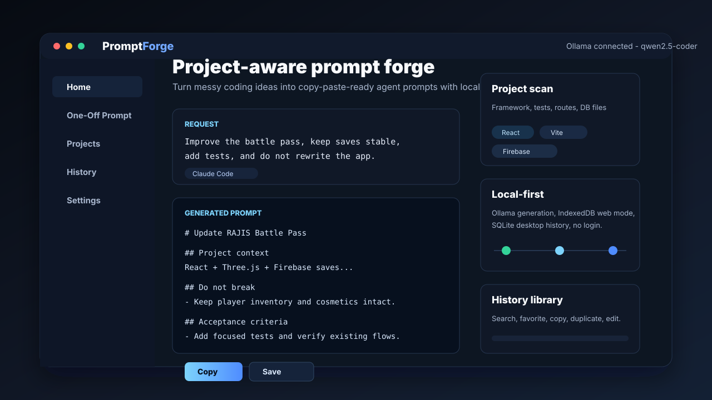
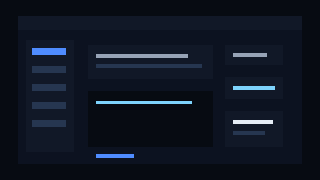
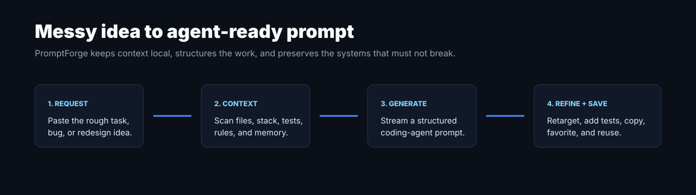

# PromptForge



A local, **Ollama-powered prompt engineer for coding agents**. PromptForge turns
messy coding ideas, bug reports, and feature requests into clean, structured,
copy-paste-ready prompts for Claude Code, Cursor, Windsurf, Replit Agent, and
other coding AIs. Not a general chatbot — it only writes coding prompts.

Everything runs locally. No login, no cloud, no code leaves your machine.

## Demo





The demo loop shows the product path: pick a workflow, provide a rough coding request,
generate a structured prompt, refine it, and save it for reuse.

## Features

- Desktop app for local Ollama-powered prompt generation.
- Browser build with IndexedDB storage and local folder scanning where supported.
- One-off prompt generator with target-agent and prompt-type controls.
- Project workspace with folder scanning, pinned files, selected context, rules, restrictions, and memory.
- Streaming output editor with copy, save, regeneration, refinement, retargeting, test, checklist, and split actions.
- Prompt history with search, favorites, edit, duplicate, delete, and copy workflows.
- Automated tests for storage, scanning, prompt construction, Ollama streaming, web parity, and starter presets.

## Requirements

- [Node.js](https://nodejs.org/) 18+
- [Ollama](https://ollama.com/) running locally with at least one model, e.g.:
  ```
  ollama pull llama3.2
  # or, ideal for coding prompts:
  ollama pull qwen2.5-coder
  ```

## Run (development)

```bash
npm install
npm run dev
```

This starts Vite and launches the Electron app. Open **Settings**, pick your model,
click **Test Connection**, then go to **One-Off Prompt** and generate.

## Download

Download the latest Windows release zip from GitHub Releases.

PromptForge is a local desktop app. Install it, start Ollama, pull a model, then open
Settings and test the connection.

## Build locally

```bash
npm run pack:win   # Windows portable app folder
npm run dist:mac   # macOS .dmg, run on macOS
```

Output lands in `release/`. The GitHub Release workflow zips the Windows portable
folder and publishes it as a downloadable release asset.

## Test

```bash
npm test                      # unit tests (ollama client, prompt engine, db)
node scripts/smoke-ollama.js  # live end-to-end generation against running Ollama
```

## Architecture

Electron, three layers with a strict privilege boundary:

- **Main process** (`electron/`) — owns the SQLite DB (`db.js`), the Ollama HTTP
  client (`ollama.js`), the prompt engine (`prompt-engine.js`), and IPC (`ipc.js`).
- **Preload** (`electron/preload.js`) — exposes a typed `window.api` via
  `contextBridge`. `contextIsolation` on, `nodeIntegration` off.
- **Renderer** (`renderer/`) — React + Vite + Zustand. UI only; calls `window.api`.

Data is stored in your OS app-data folder as `promptforge.db`.

The renderer is environment-agnostic: `renderer/src/api.js` delegates to Electron's
`window.api` when present, and otherwise to a browser implementation in
`renderer/src/web/` (IndexedDB storage, File System Access folder scanning, and an
OpenRouter-via-Worker backend). The same React app powers both the desktop and web builds.

## Releases

Release builds are handled by [`.github/workflows/release.yml`](.github/workflows/release.yml).
Push a version tag like `v0.2.0` and GitHub Actions builds the portable Windows zip,
uploads the release file, and publishes a GitHub Release.

See [RELEASE.md](RELEASE.md) for the exact release checklist.

## License

MIT

